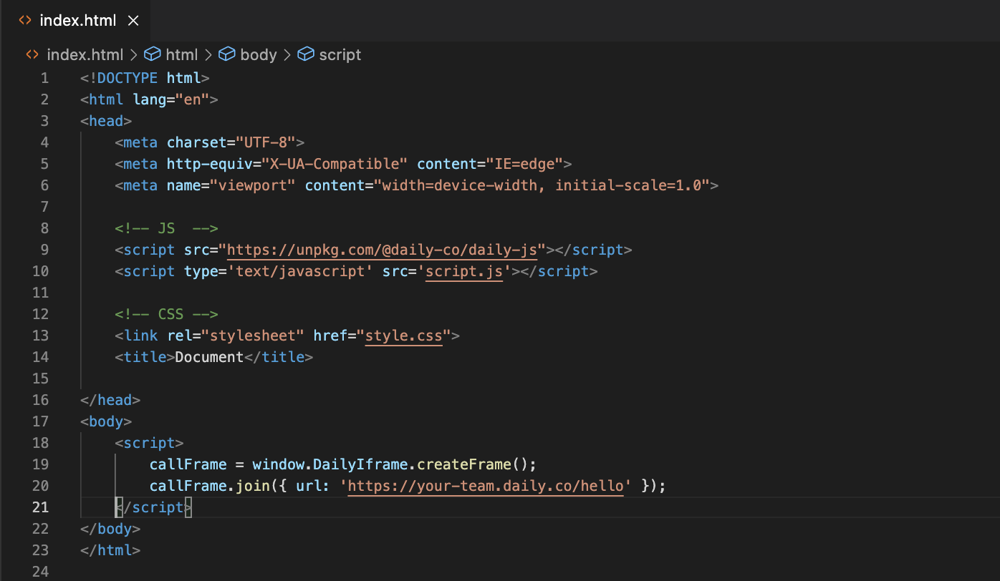
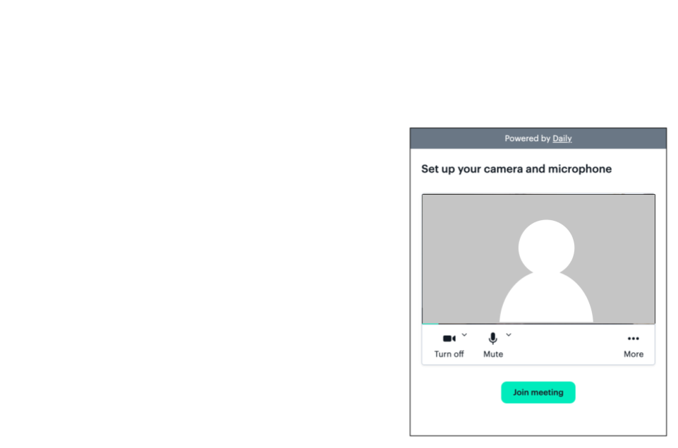
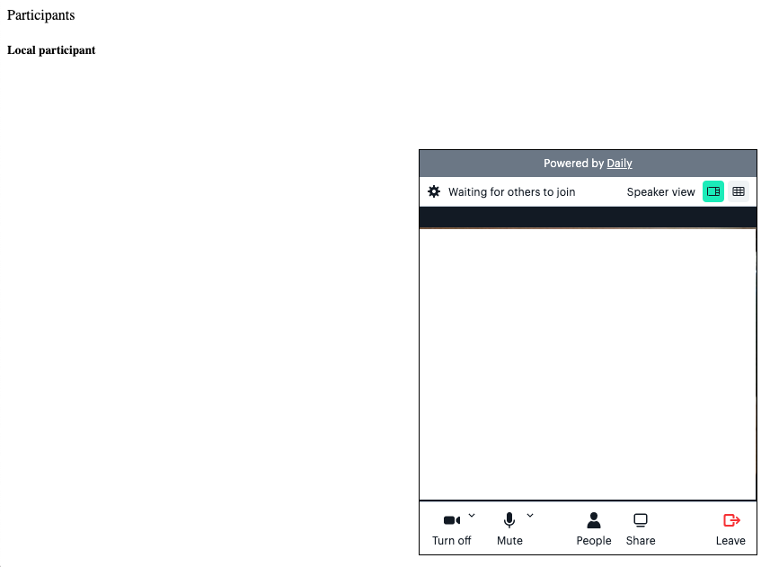
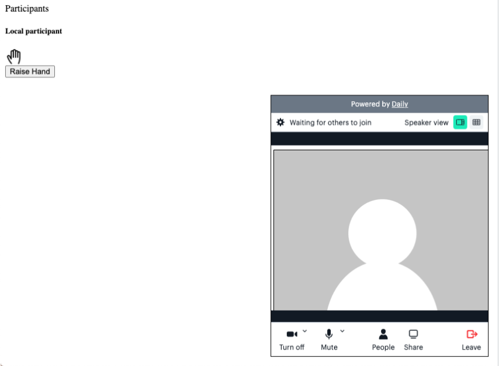

## Set up your environment

You can create your own video chat interface using the Daily-js front-end library and JavaScript, HTML, and CSS!

The Daily JavaScript library gives you several options for adding video calls to your web app. There's so many possibilities, but we'll focus on the "Raise your hand" feature. 

Let's go step by step over what you'll need and why. We're going to write everything in our HTML file, but you can separate the code based on JS or CSS. The CSS is not included in this breakdown so you're free to choose your own style and look!


<hr>

### Set up HTML
- [ ] Basic HTML page

Set up the basic HTML DOCTYPE structure (https://www.w3schools.com/html/)
Create something like `index.html`, or name it anything you'll remember as long as you save it as `.html`
In a basic template, you can change the title in the `<head>` and add more information, but with that basic HTML structure. 

You have your basic html page set up! 


```
<!DOCTYPE html>
<html lang="en">
  <head>
      <meta charset="UTF-8">
      <meta http-equiv="X-UA-Compatible" content="IE=edge">
      <meta name="viewport" content="width=device-width, initial-scale=1.0">
      <title>Document</title>
  </head>
  <body>
      
  </body>
</html>
```
<hr>

#### Optional: Set up JavaScript
- [ ] Basic JavaScript file

If you're separating your code based on HTML, JS, or CSS, then you'll also need to create something like `script.js`, or name it anything you'll remember as long as you save it as `.js`

<hr>

#### Optional: Set up CSS

- [ ] Basic CSS file

If you're separating your code based on HTML, JS, or CSS, then you'll also need to create something like `style.css`, or name it anything you'll remember as long as you save it as `.css`

<hr>

#### Optional: Connect them!
If you have three files, just because the files are in the directory (aka folder), doesn't mean they realize the others exist. So we'll connect them all in our HTML file.

In the <head> of your HTML file, you'll need to connect your Javascript and CSS with the following tags:

- [ ] Connect JS file
```
<script type='text/javascript' src='script.js'></script>
```

- [ ] Connect CSS file
```
<link rel="stylesheet" href="style.css">
```
<hr>
<br>

# Before integrating Daily 
There are a couple of housekeeping steps:
1. Register at Daily.co
    This might seem redundant to mention, but this part is important because in order to customize and add features, you'll need what is called a `[Daily room URL]`(https://help.daily.co/en/articles/4202139-creating-and-viewing-rooms) because you'll be replacing the default code the Daily gives us with your own room URL.

    ```
    Look for this code: 
    https://your-team.daily.co/hello
    OR
    A_DAILY_CO_ROOM_URL
    ```

2.  Have the docs for Daily JS handy
    We're going to be referencing this documentation a lot: https://docs.daily.co/reference/daily-js


<hr>

# How to set up Daily.co video calls
## Connect to Daily.co by loading the library in a script tag

The easiest way to get started is to load this library from unpkg, and add a couple of lines of code to your web page or app. We're going to embed a Daily prebuilt into our files. You can refer to the docs where it mentions it: https://docs.daily.co/prebuilt#step-by-step-guide-embed-daily-prebuilt

You can just copy and paste this exact code into the `<head>` of your HTML file.

```
<script crossorigin src="https://unpkg.com/@daily-co/daily-js"></script>
``` 


<hr>

## Create the Daily.co video call component 
There are a couple of ways we can add a frame (i.e. callObject, createframe(), etc), but we're going to embed the code Daily has so kindly shared for a prebuilt video call component. We've already referred to the docs here: https://docs.daily.co/prebuilt#step-by-step-guide-embed-daily-prebuilt

The Daily JS library script tag is already added in the `<head>`, so we're going to add the code snippet to the HTML's `<body>` and replacing the `https://your-team.daily.co/hello` in the code snippet with our own room URL.

```
<script>
      callFrame = window.DailyIframe.createFrame();
      callFrame.join({ url: 'https://your-team.daily.co/hello' });
</script>
```



At this point, you can start testing it out! Double click your `index.html` and it'll open up in your web browser and you'll be able to see your own personal video room. Don't worry about how it looks. You can change that with CSS if you want to.

##### Note: You might have noticed that you can't leave the call 😶 You'll need to add some configuration properties to `DailyIframe.createFrame()` to customize how the DailyIframe looks. For the leave call button, just add `showLeaveButton: true,` into the `DailyIframe.createFrame()`. For more information, check out: https://docs.daily.co/reference/daily-js/daily-iframe-class/properties

```
callFrame = window.DailyIframe.createFrame({
  showLeaveButton: true,
});
```
<hr>

# Daily.co API Events 
In the Daily.co docs, these are specific events we can listen for and react to with the JS functions (or callbacks): https://docs.daily.co/reference/daily-js/events. We're going to code this raise hand feature by first creating the local participant and then other participants. 

## Local Participant
For a local participant, we want to know when they join, when they click on a button to raise their hand, and when they leave. We're going to use daily-js video call events for our local participant and create a customized JavaScript event listener for that raising hand feature.

### Local Participant Events
* `on()`: This is an instance method that we'll add after joining the call and will evoke after callframe. This method will include an eventName as well as a callback. The eventName could be any of the Events listed in the daily-js docs: https://docs.daily.co/reference/daily-js/events. The callbacks are the functions you'll create. 

* `joined-meeting`: This meeting event is when a local participant joins the call. It will return a list of all the participants: https://docs.daily.co/reference/daily-js/events/meeting-events#joined-meeting 

* `left-meeting`: This meeting event is when a local participant leaves the call: https://docs.daily.co/reference/daily-js/events/meeting-events#left-meeting

  ```
  <!-- eventNames -->
  callFrame.on("joined-meeting", joinedCall)
  callFrame.on("left-meeting", leftCall)

  <!-- callbacks -->
  function joinedCall(){

  }

  function leftCall(){
    
  }
  ```
<kbd>

Refer to `01-dailyco_events.html` in the <b>Steps</b> folder to see code at this point.
</kbd>

 <hr>
 <br>

### React when a user joins a call
Within the callback function of `joinedCall()` with the `e` (event) being referred to. 

Then once "inside" that function, we're going to evoke another function where we'll create the participant. The `joined-meeting` event gives us important information like user_id and username. You can even check it out in your console with `e.participants.local`

This is also the point where I'll need to start creating elements in the `<body>` so I can see what is happening. We'll use a custom JavaScript function called `createParticipantDiv()` that'll create a `<div>` with the participant's information. We're using `<div>` elements so we can append, select, and eventually remove them from our list.

If I want to see all these new participants joining, I'm going to need to code space in the HTML to accommodate them. I'm going to create a `<div>` element to append all these new participant divs within my HTML. Just above the `<script>` tag.

```
<!-- HTML: In the body, above the script tags -->
<div id="participantsList">
            Participants
</div>
```

```
<!-- JS: Below the script tag -->

async function joinedCall(e){
  createParticipantDiv(e.participants.local.user_id, e.participants.local.user_name)
}

function createParticipantDiv(id, username){
  let dailyUser = document.createElement('div')
   
   dailyUser = `
                   <div id=${id} class="participantBlock">
                    
                     <div class="participantBlock-item" id="usernameDiv"><h5>${username}</h5></div>
                 
                       
                       
            
                   </div>
                 `
   addParticpipant.innerHTML += dailyUser
}
``` 
##### Note: The createParticipantDiv function works for both local and other participants. 
<br>

<kbd>

Refer to `02-react_to_local_joining.html` in the <b>Steps</b> folder to see code at this point.
</kbd>

#### Let local participant raise their hand
Here is where we start implementing the `Raise Hand` feature. We're going to create a button for our `Raise Hand` feature, a variable for the handState, as well as custom JavaScript event listeners called `toggleHand()` and `sendingUpdates()`, and we'll use a Daily.co Instance method: `sendAppMessage()`. 

- [ ] For the variable, just add `let raisingHand;` just below the `<script>` tag. This will be a global variable that we can refer to in any function. 

- [ ] For the button, we're adding a unique ID as well as the onClick() JavaScript event. 

```
<!-- In the body, above the script tags -->
<button
  id="raise_hand_container"
  onclick="toggleHand()"
  >
  Raise Hand
</button>
```
- [ ] For `toggleHand()`, we're going to do an if/else statement based on whether or not the raisingHand is true or false. I've created variables that refer to the local participant information such as user_id and username.

  * If `!raisingHand` (not raisingHand), we'll make `raisingHand = true` when I click on the button and display our hand. Else, `raisingHand = false` when I last clicked and we'll hide the hand. I'll need to add some styling to my elements now (style.display="none" and style.display="block")
  * Package that information in a hash where we'll have information referring to the person clicking such as ID, username, and now our raisingHand status.

- [ ] `sendAppMessage()`: This instance method will send a message to other participants, or another specific participant, during the call. To do something with that information, we'll use the Daily.co `app-message event`, adding a callback function `sendingUpdates`. For more information, check out the docs: https://docs.daily.co/reference/rn-daily-js/instance-methods/send-app-message#main 

```
callFrame.sendAppMessage(update, "*");
```

- [ ] For `sendingUpdates()`, we'll need to add another `.on()` event that will evoke `sendingUpdates()` and determine if the message.data.status (which is my handState) is true, show the hand block that we added while creating the participant. If the message.data.status is false, remain hidden.

<kbd>

Refer to `03-local_hand.html` in the <b>Steps</b> folder to see code at this point.
</kbd>

<br>

#### React when a user leaves a call
We'll need to add another `.on()` event that will evoke when the local participant leaves. And as they leave, we'll just refresh their page so everything gets cleaned. Refer to `04-react_to_local_leaving.html` in <b>Steps</b>. 

```
  function leftCall(e){
    location.reload();
  }
```

## Other Participants
For other participants, we want to know when they join, when they click on a button to raise their hand, and when they leave.

### Participant Events
* `on()`: We'll still be using this instance method for other participants. Remember this method will include an eventName as well as a callback. The eventName could be any of the Events listed in the daily-js docs: https://docs.daily.co/reference/daily-js/events. The callbacks are the functions you'll create. 

* `participant-joined`: This meeting event is when a local participant joins the call. It will return a list of all the participants: https://docs.daily.co/reference/daily-js/events/meeting-events#joined-meeting 

* `participant-left`: This meeting event is when a local participant leaves the call: https://docs.daily.co/reference/daily-js/events/meeting-events#left-meeting


### React when participant joins
We'll use similar logic to when local joined. This function can be called `participantJoined()` with the `e` being referred to. We'll evoke the `createParticipantDiv()` function that'll create the new participant and add to our list. This new participant will have the same features and actions as a local, but with their unique information. 

```
<!-- With other instance methods -->
.on("participant-joined", participantJoined)

<!-- Callback function -->
function participantJoined(e){
  createParticipantDiv(e.participant.user_id, e.participant.user_name)
}
```

### React when participant leaves
When a participant (that isn't local) leaves, we need to remove their name and reset. 

```
<!-- With other instance methods -->
.on("participant-left", participantLeft)

<!-- Callback function -->
function participantLeft(e){
  let participantSessionId = e.participant.session_id
  document.getElementById(participantSessionId).remove()
  callFrame.sendAppMessage()
}
```

# Ya done!
You have the basic structure! 

You might have noticed a couple of things like it's barebones with CSS. That's OK! You can change how it looks by adding to the `style.css` we created in the beginning. 

There's a couple of other examples of how one can code this feature. Beauty (and curse) of JavaScript is that there are a million ways. This is just one way. The important part is understanding what parts are needed to create this video call. And luckily Daily.co helps out with the bulk of this code! Thanks Daily.co

