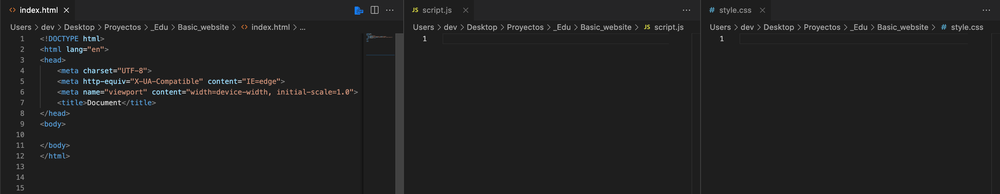
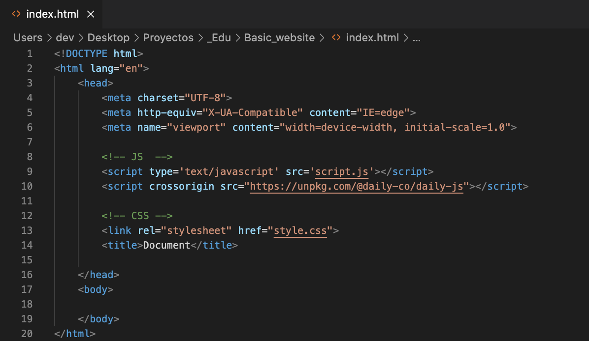
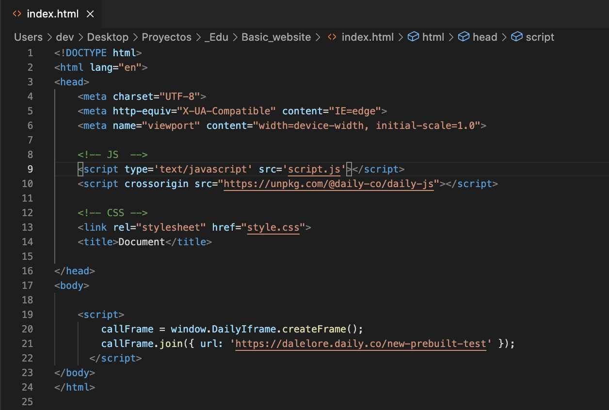

# Lorena | Daily 
## Raise your hand
This sample work includes sample code and a piece of content about implementing a `Raise your hand` feature during a video call in the form of a developer tutorial on Daily.co's blog: https://www.daily.co/blog/

## Set up your environment
You can create your own video chat interface using the Daily-js front-end library and three separate files: JavaScript, HTML, and CSS!

The Daily JavaScript library gives you several options for adding video calls to your web app. There's so many possibilities, but we'll focus on the "Raise your hand" feature. 

Let's go step by step over what you'll need and why. We're going to keep all our files on the same level (aka folder). We'll be using three basic pages: HTML, CSS, and JavaScript (including Daily's JS library).


<hr>

### Set up HTML
- [ ] Basic HTML page

Set up the basic HTML DOCTYPE structure (https://www.w3schools.com/html/)
Create something like `index.html`, or name it anything you'll remember as long as you save it as `.html`
In a basic template, you can change the title in the `<head>` and add more information, but with that basic HTML structure. 

You have your basic html page set up! 


```
<!DOCTYPE html>
<html lang="en">
  <head>
      <meta charset="UTF-8">
      <meta http-equiv="X-UA-Compatible" content="IE=edge">
      <meta name="viewport" content="width=device-width, initial-scale=1.0">
      <title>Document</title>
  </head>
  <body>
      
  </body>
</html>
```
<hr>

### Set up JavaScript
- [ ] Basic JavaScript file

Create something like `script.js`, or name it anything you'll remember as long as you save it as `.js`

And you're done with basic set up! Yes, it's OK if it's empty at the moment. This is were we'll be adding our events and logic for the Daily JS library and user interactions/actions. 
<hr>

#### Set up CSS

- [ ] Basic CSS file

Create something like `style.css`, or name it anything you'll remember as long as you save it as `.css`

And you're done with basic set up! Yes, it's OK if it's empty at the moment. This is were we'll be adding classes, ids, and other code for the site's appearance.

<hr>

#### Connect them!
Just because the files are in the directory (aka folder), doesn't mean they realize the others exist. So we'll connect them all in our HTML file.

In the <head> of your HTML file, you'll need to connect your Javascript and CSS with the following tags:

- [ ] Connect JS file
```
<script type='text/javascript' src='script.js'></script>
```

- [ ] Connect CSS file
```
<link rel="stylesheet" href="style.css">
```

#### Review: Environment setup
You should have three files: `index.html`, `script.js`, and `style.css` With that connect, let's start adding our Daily JS library functions.


<hr>
<br>

# Before integrating Daily 
There are a couple of housekeeping steps:
1. Register at Daily.co
    This might seem redundant to mention, but this part is important because in order to customize and add features, you'll need what is called a `[Daily room URL]`(https://help.daily.co/en/articles/4202139-creating-and-viewing-rooms) because you'll be replacing the default code the Daily gives us with your own room URL.

    ```
    Look for this code: 
    https://your-team.daily.co/hello
    OR
    A_DAILY_CO_ROOM_URL
    ```

2.  Have the docs for Daily JS handy
    We're going to be referencing this documentation a lot: https://docs.daily.co/reference/daily-js


<hr>

# How to set up Daily.co video calls
## Connect to Daily.co by loading the library in a script tag

The easiest way to get started is to load this library from unpkg, and add a couple of lines of code to your web page or app. We're goign to embed a Daily prebuilt into our files. You can refer to the docs where it mentions it: https://docs.daily.co/prebuilt#step-by-step-guide-embed-daily-prebuilt

```
<script crossorigin src="https://unpkg.com/@daily-co/daily-js"></script>
``` 

You can just copy and paste that exact code into the `<head>` of your HTML file.
<br>


<hr>

## Add UI Elements
There are a couple of elements needed for this. We'll be building out our User Interface elements in our HTML file first. And then we connect them to JS and CSS so they all communicate with each other.

We'll need:
- [ ] Daily.co call frame: This is for the video call
- [ ] Hand Button: This is the feature we're are implementing
- [ ] Participants: We'll need to know who is who when people start toggling their hands

### Add UI element: Daily.co Frame
There are a couple of ways we can add a frame (i.e. callObject, createframe(), etc), but we're going to embed the code Daily has so kindly shared for a Daily prebuilt video call component. We're already referred to the docs here: https://docs.daily.co/prebuilt#step-by-step-guide-embed-daily-prebuilt

The Daily JS library script is already added, but we're going to add the code snippet for the video call into the `<body>` of our HTML page.

```
  <body>
    <script>
      callFrame = window.DailyIframe.createFrame();
      callFrame.join({ url: 'https://your-team.daily.co/hello' });
    </script>
  </body>
```

My HTML is starting to look like this. I've replaced `https://your-team.daily.co/hello` in the code snippet with my own room URL.




At this point, you can start testing it out! Double click your `index.html` and it'll open up in your web browser and you'll be able to see your own personal video room. Don't worry about how it looks. That's where CSS and JS come in.

