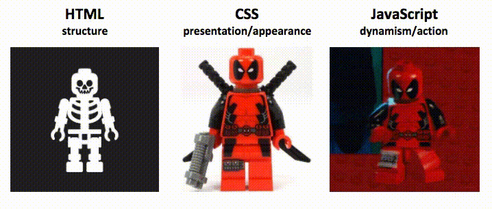
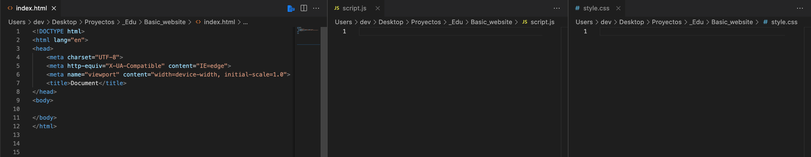
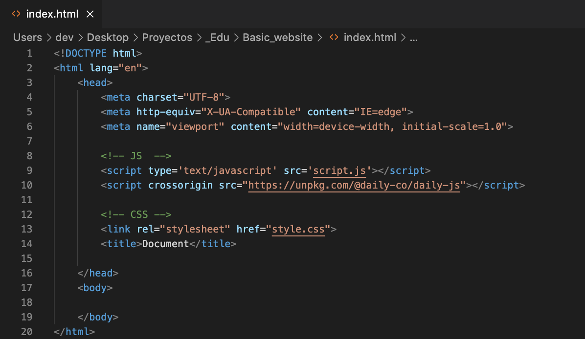

# Lorena | Daily 
## Raise your hand
This sample work includes sample code and a piece of content about implementing a `Raise your hand` feature during a video call in the form of a developer tutorial on Daily.co's blog: https://www.daily.co/blog/

## Set up your environment
You can create your own video chat interface using the Daily-js front-end library and three separate files: JavaScript, HTML, and CSS!

The Daily JavaScript library gives you several options for adding video calls to your web app. There's so many possibilities, but we'll focus on the "Raise your hand" feature. 

Let's go step by step over what you'll need and why. We're going to keep all our files on the same level (aka folder). We'll be using three basic pages: HTML, CSS, and JavaScript (including Daily's JS library).



<hr>

### Set up HTML
- [ ] Basic HTML page

Set up the basic HTML DOCTYPE structure (https://www.w3schools.com/html/)
Create something like `index.html`, or name it anything you'll remember as long as you save it as `.html`
In a basic template, you can change the title in the `<head>` and add more information, but with that basic HTML structure. 

You have your basic html page set up! 


```
<!DOCTYPE html>
<html lang="en">
  <head>
      <meta charset="UTF-8">
      <meta http-equiv="X-UA-Compatible" content="IE=edge">
      <meta name="viewport" content="width=device-width, initial-scale=1.0">
      <title>Document</title>
  </head>
  <body>
      
  </body>
</html>
```
<hr>

### Set up JavaScript
- [ ] Basic JavaScript file

Create something like `script.js`, or name it anything you'll remember as long as you save it as `.js`

And you're done with basic set up! Yes, it's OK if it's empty at the moment. This is were we'll be adding our events and logic for the Daily JS library and user interactions/actions. 
<hr>

#### Set up CSS

- [ ] Basic CSS file

Create something like `style.css`, or name it anything you'll remember as long as you save it as `.css`

And you're done with basic set up! Yes, it's OK if it's empty at the moment. This is were we'll be adding classes, ids, and other code for the site's appearance.

<hr>

#### Connect them!
Just because the files are in the directory (aka folder), doesn't mean they realize the others exist. So we'll connect them all in our HTML file.

In the <head> of your HTML file, you'll need to connect your Javascript and CSS with the following tags:

- [ ] Connect JS file
```
<script type='text/javascript' src='script.js'></script>
```

- [ ] Connect CSS file
```
<link rel="stylesheet" href="style.css">
```

#### Review: Environment setup
You should have three files: `index.html`, `script.js`, and `style.css` With that connect, let's start adding our Daily JS library functions.


<hr>
<br>

# Before integrating Daily 
There are a couple of housekeeping steps:
1. Register at Daily.co
    This might seem redundant to mention, but this part is important because in order to customize and add features, you'll need what is called a `[Daily room URL]`(https://help.daily.co/en/articles/4202139-creating-and-viewing-rooms) because you'll be replacing the default code the Daily gives us with your own room URL.

    ```
    Look for this code: 
    https://your-team.daily.co/hello
    OR
    A_DAILY_CO_ROOM_URL
    ```

2.  Have the docs for Daily JS handy
    We're going to be referencing this documentation a lot: https://docs.daily.co/reference/daily-js


<hr>

# How to set up Daily.co video calls
## Connect to Daily.co by loading the library in a script tag

The easiest way to get started is to load this library from unpkg, and add a couple of lines of code to your web page or app. We're goign to embed a Daily prebuilt into our files. You can refer to the docs where it mentions it: https://docs.daily.co/prebuilt#step-by-step-guide-embed-daily-prebuilt

```
<script crossorigin src="https://unpkg.com/@daily-co/daily-js"></script>
``` 

You can just copy and paste that exact code into the `<head>` of your HTML file.
<br>


<hr>

## Add UI Elements
There are a couple of elements needed for this. And then we connect them so they all communicate with each other.

We'll need:
- [ ]Daily.co call frame
    This is for the video call
(2) Hand Button
    This is the feature we're are implementing
(3) Participant List
    This is so partipicants knows who are on the call and can see your hand raised 

#### Add my elements: The Frame
This option is a combo of HTML/JS so they are definitely different ways of doing this, but if you've checked Daily's docs, there's a lot there. And you're probably come across the embed Daily Prebuilt code (https://docs.daily.co/prebuilt)

```
<html>
  <script crossorigin src="https://unpkg.com/@daily-co/daily-js"></script>
  <body>
    <script>
      callFrame = window.DailyIframe.createFrame();
      callFrame.join({ url: 'https://your-team.daily.co/hello' });
    </script>
  </body>
</html>
```

There's different ways to do this but we'll go with the simplest at the moment which is first adding `<script crossorigin src="https://unpkg.com/@daily-co/daily-js"></script>` in the HTML's `<head>` and then including the following code into our `<body>` in the HTML.

```
<script>
    callFrame = window.DailyIframe.createFrame();
    callFrame.join({ url: 'https://your-team.daily.co/hello' });
</script>
```

You can even test it out! Double click your `index.html` and it'll open up in your web browser and you'll be able to see your own personal video room. Don't worry about how it looks. That's where CSS and JS come in.


#### Add my elements: The Button
We're going to add a button that raises and lowers your hand by toggling between "Need to ask a question?" and "Your Hand is Raised!" accordingly.

For this, HTML has a button tag!
`<button></button>`

We're going to give it:
*  ID 
   `id="raise_hand"`
    It can be anything you want, as long as you remember that it's for the button
* JS onclick event
    `onclick="raiseYourHand()"`
    More information: https://www.w3schools.com/jsref/event_onclick.asp
* Text (or emojis!) for button
    You can write 'Click Me', 'Raise Hand', or even use an emoji 🤚🏼 for the button content.

That button now needs to toggle some text so we're going to create another `<div>`, give it an ID, and write the default text: "Need to ask a question>" 

It should end up like this:
```
<div class="participants">
    <button 
        id="raise_hand"
        onclick="raiseYourHand()">
                🤚🏼
    </button>
    <div id="toggleHand">Need to ask a question?</div>
</div>
``` 

If you click on it now, nothing's going to happen because we need to give it some JavaScript logic, but that'll come! Continue to participant list.

#### Add my elements: The List
The list will be literally an unordered list so in the HTML body, preferrably within the `<div>` we added the button so they can all be together, create an unordered list: https://www.w3schools.com/tags/tag_ul.asp

`<ul class="participant_list"></ul>`

I gave it a class so we can do CSS on it later. Right now, it's just pure HTML 😎

### Add my JS Logic
This is where we start connecting JS logic to our HTML. All of our elements: the frame, the button, the list, are on our page, but they don't know that other elements exist.

Similar to what we did with connecting the daily-js library beforehand, we're going to connect all the elements with JS.

async function updateHandState(message) {
    console.log("triggered")
    console.log(message.data.username)
    console.log(message.data)

    let currentListHTML = document.getElementById("participant_list");

    let participant = `<li id="${message.data.user_id}">
                        <h5>${message.data.username}</h5>
                      </li>`;

    if (message.data.status == true){
      console.log("hand is raised")
      
      currentList.push(participant)
      currentListHTML.innerHTML += currentList

      console.log("after push:", currentList)
      console.log("after push:", currentListHTML)

    } else if (message.data.status === false){
      console.log("hand is lowered")
    }

  }
